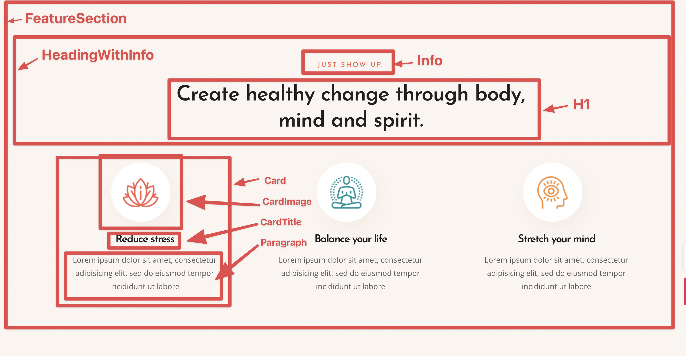

# React StyleGuide

> The Best way to build React.js Apps

## What it is

These are list of coding best practices and coding standards. We will use in our project development. This will make sure consistent development of project accross the team . And it also improves code quality of the project. 


## Component Planning

Before writing code for a particular design of a page or a project. The first step should be planning what components you will create in this particular page or a feature. Determine their name and write it down somewhere. To name the components you can discuss with your peers. The Component names should be  in PascalCase . Once you have listed them down it's time to separate them into two categories Atomic components and Non-atomic Components. Atomic Components are the one's which they make up the UI library of the project.They become the foundation of Non-atomic Components. Non Atomic Components are created by composing Atomic Components together. Example of atomic components could be `Input`, `Card`, `Column`, `Button`,`Heading`, `Popup`, `Tooltip`, etc. Non Atomic Component could be a particular section of page, Sidebar with widgets, etc.

### Example of Component Plan


The above image is a screenshot of a section. The main Component is the whole section called `FeatureSection` which has the following child components : 

- `HeadingWithInfo` (Non-atomic)
- `Card` (Atomic)
- `CardImage` (Atomic)
- `CardTitle` (Atomic)
- `Paragraph` (Atomic)
- `H1` (Atomic)
- `Info` (Atomic)


## Prop Planning

Prop planning means planning the name and type of props a component will have . Lets take the example of Above `FeatureSection` Component. `HeadingWithInfo` component can have two props named `info` and `title` and both of these props will be of type string. Lets make the prop diagram of the above mentioned components.

> StyleProps = {style: React.CSSProperties; className: string;} \
 StyleProps here refers to Common Styling Props that could be useful in overriding the Atomic component in some places.

- `HeadingWithInfo`
    - `title: string`
    - `info: string`
- `Card`
    - `children: React.ReactNode`
    - `...StyleProps`
- `Card`
    - `children: React.ReactNode`
    - `...StyleProps`
- `CardImage`
    - `src: string`
    - `alt: string`
    - `...StyleProps`
- `CardTitle`
    - `children: React.ReactNode`
    - `...StyleProps`
- `Paragraph`
    - `children: React.ReactNode`
    - `...StyleProps`


## State Planning

State Planning refers to the state variables that you need in order to create the component. And in which component the state will be located in the component tree.


## Basic Rules

- Always use Typescript
- Only One Component Per File
- Follow Don't Repeat Yourself (DRY) principle
- Code should always be formatted before being pushed to Github, or any other repo
- Always prefer function components
- use Arrow functions everywhere unless it is absolutely necessary.

# Naming

Naming of components should follow the following guidelines:
- Component filenames should be PascalCase e.g `CardImage`, `HeaderWithInfo`,etc 
- Hooks name should be camelCase e.g `useIsomorphicEffect`, `useTabs`, etc
- Functions for example helper functions and event handler function will also be camelCase e.g `waitFor`, `calculateRoi`, etc
- Prop names and state variables should be camelCase.

# Imports

Points to remember when importing components from external libs or iternally.
- Imports of components should be properly formatted.

```js
//bad
import React, {useEffect,
useState} from "react";

// good
import React, { useEffect, useState } from "react";

// bad
import cardImage from './CardImage';

// good
import CardImage from "./CardImage";

// good
import axios from "axios";

// bad
import Footer from './Footer/Footer';

// bad
import Footer from './Footer/index';

// good
import Footer from './Footer';

```

# Props

- Always use CamelCase for Props

```jsx
// bad
<Foo
  UserName="hello"
  phone_number={12345678}
/>

// good
<Foo
  userName="hello"
  phoneNumber={12345678}
  Component={SomeComponent}
/>
```

- Avoid adding Extra Braces inside props.

```jsx
// bad
<Card hidden={true} />


// good
<Card hidden />


// bad
<Card title={"Awesome Title"} />

// bad
<Card title={ "Awesome Title" } />

// good
<Card title="Awesome Title" />
```

# Ordering 

> Ordering is very important while writing standardized code

Ordering means ordering various parts inside the source code of components. Following order should be followed while writing source code of components:
- `useState` Hook
- `useReducer` Hook
- `useContext` Hook
- `useRef` Hook
- external library hooks
    - `useSelector`
    - `useDispatch`
    - `useActions`
    - etc
- `useMemo` Hook
- `useCallback` Hook
- Any event handlers like `handleSubmit`, `handleClick`, etc
- `useImperativeHandle` Hook
- `useLayoutEffect`
- `useEffect`
- methods return Jsx like `renderContent`, `renderPopup`, etc


After that you will write the return statement which returns jsx of the component.

# Refs

Instead of using Refs directly by assigning or reading `ref.current` property of `ref`, create getter and setter functions for `ref` called getRef and setRef.

```js
// bad
ref.current = "hello"
console.log(ref.current);

// good
const setRef = (val: string) => {
    ref.current = val;
}
const getRef = () => {
    return ref.current;
}
setRef("Hello");
console.log(getRef());


```

# Tags

- Always use self closing tags that have no children.

```jsx
// bad
<Foo variant="stuff"></Foo>

// good
<Foo variant="stuff" />
```

- If your component has multi-line properties, close its tag on a new line.

```jsx
// bad
<Foo
  bar="bar"
  baz="baz" />

// good
<Foo
  bar="bar"
  baz="baz"
/>
```

# Key Prop in Lists
> Avoid using an array index as key prop, prefer a unique ID.

```jsx
// bad
{todos.map((todo, index) =>
    <Todo
        {...todo}
        key={index}
    />
)}

// good
{todos.map(todo => (
        <Todo
            {...todo}
            key={todo.id}
        />
    );
)}
```